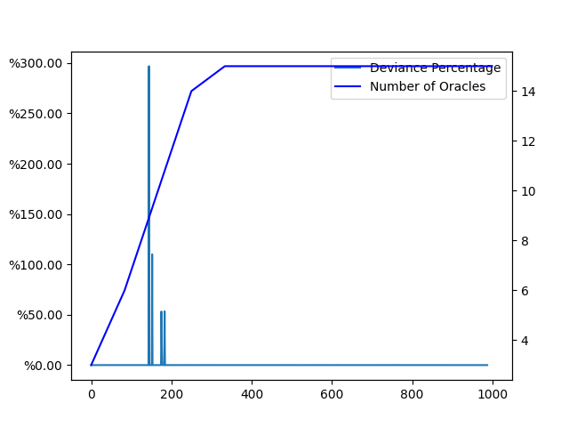
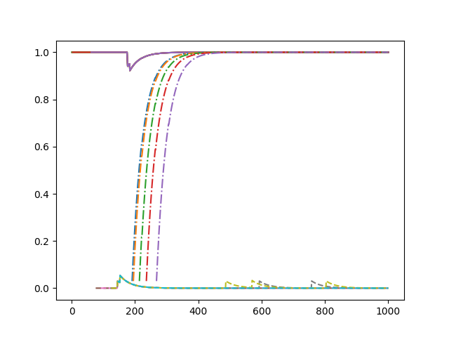
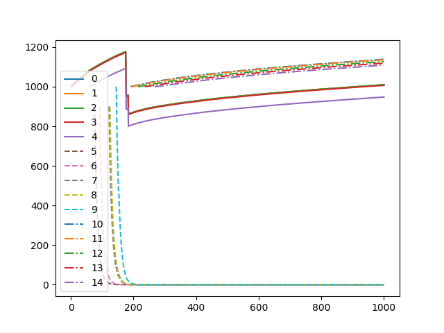
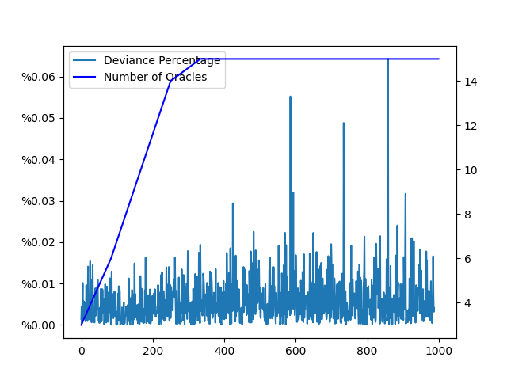
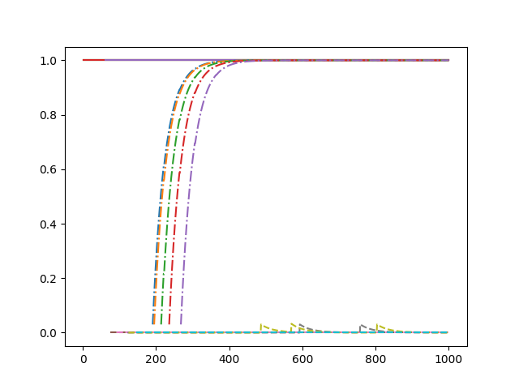
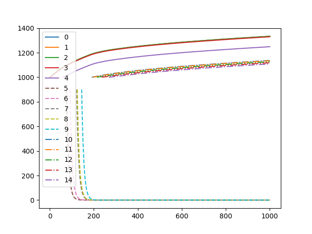
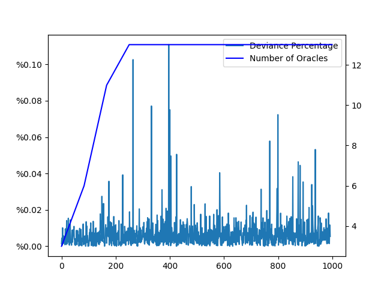
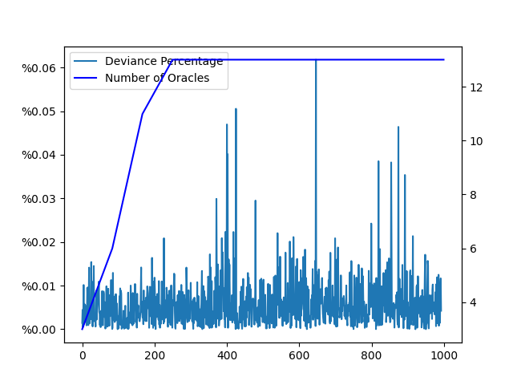

# Nebulae Protocol Simulation Results

As we work towards refining our oracle protocol, we are keen on presenting the simulation results performed under diverse configurations. The aim is to illustrate the effectiveness and safety of our protocol.

Below is our simulation configuration parameters in JSON:

```json
{
  "rnd_seed": 0,
  "iteration": 1000,
  "trusted_nodes": 5,
  "when_trusted_leaves": 100,
  "malicious_nodes": 5,
  "honest_nodes": 5,
  "min_nodes_for_consensus": 3,
  "node_join_prob": 0.03,
  "node_leave_prob": 0.01,
  "min_stake": 1000,
  "max_stake": 1000,
  "initial_reputation": 0,
  "initial_trusted_reputation": 1,
  "not_responding_prob": 0.01,
  "not_responding_slash": 0.01,
  "wrong_slash": 0.1,
  "allowed_deviation": 0.01,
  "reputation_coefficient": 0.03,
  "round_award": 1,
  "bonus_award": 5,
  "bonus_curve": "exp",
  "std_dev_relative_to_true": 0.1,
  "std_dev_scale_trusted": 0.001,
  "std_dev_scale_malicious": 100,
  "malicious_act_prob": 1,
  "std_dev_scale_honest": 0.01,
  "consensus_algorithm": "median"
}
```

We'd like to highlight some unique parameters:

- **`consensus_algorithm`**: We are employing two algorithms: **`median`** (the classic oracle approach), **`w_median`** (weighted median considering reputation of the nodes - our approach).
- **`bonus_award`**: In the initial round, we have bonus awards which incentivize the early contributors to the network. With time and successive rounds, this reward decreases following a particular **`bonus_curve`** till it converges to zero, after which we only offer the **`round_award`**.
- **`rnd_seed`**: ***We are using a random seed to ensure fair execution of our experiments across different configurations.***

### **Starting with Trust / Bootstrapping**

As per our protocol, we're starting with a bootstrapped network of trusted nodes. These nodes are operated by us and are reputed for reporting accurate prices.

## Adversarial Mode

We begin the experiment with **5** bootstrapped nodes, adding **5** malicious nodes to test the resilience of our network. Later, we bring in **5** honest nodes, which we assume are 3rd party oracles.

### Median Consensus

After adding the malicious nodes, we predict that the network will exhibit a high deviation from the original price, leading to inaccurate network behaviour, once the number of correct oracles fall below 2/3.


- Deviation from the true value:



The high errors and deviation from the true value, prior to the addition of honest 3rd party nodes, met our expectations.


- Let's observe the reputation and stakes of nodes:





This mechanism resulted in slashing of even the correct participants. Despite the network recovering post the addition of sufficient nodes, some honest participants experienced losses.


### Weighted Median with Reputation Consensus

The weighted median consensus was designed as a robust and efficient approach to counteract any adversity from the malintent of participants.


- Deviation from the true value:



Despite the presence of malicious participants, this algorithm handled the errors efficiently, with a peak deviation of **0.06%**. This proves to be a much sturdier approach than the classic median.

- Let's again observe the reputation and stakes of nodes:





This approach ensured a steady reward/punish model that handled our goals more efficiently.


## General Mode
Since the median-based oracles fundamentally rely on the assumption of at least 2/3 honest participants, we repeated the simulation with fewer malicious nodes that abide by this assumption. This allowed us to analyze the superiority of our approach under general conditions.

Limiting the malicious oracles to **3** ensured they never cross the 1/3 limit. For simplicity, we only plotted the deviations.

- Median



- Weighted Median



The results indicate that the weighted median approach delivers **40%** less deviation and more stable feeds, outperforming the traditional approach.


## Wrapping Up
The simulation results reinforce our confidence in the weighted median approach for its aptitude in serving our needs. We are continually working towards simulating more real-world scenarios and aim to publish an in-depth simulation system to optimize the configuration for our releases further.

While the simulation primarily focused on deviations, the findings will also aid in optimizing our tokenomics and incentivization system. We're excited about the potential upgrades and improvements the future holds.